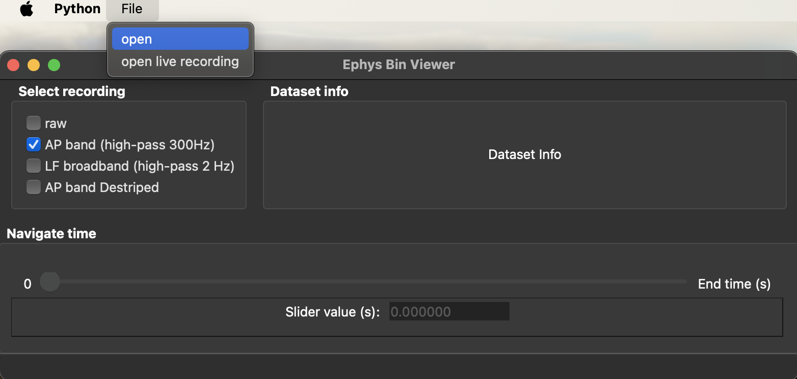
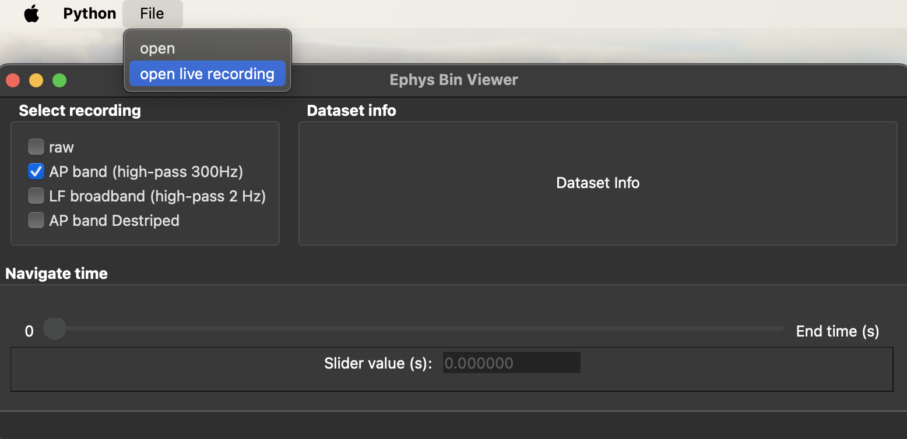

# Quickstart

viewephys can be used in three common workflows:

1. Open an existing recording to inspect previously acquired data.
2. Monitor a live recording during data acquisition.
3. Visualize recordings and processed data from Python.

The first two workflows are covered in this guide. For Python-based workflows, see [Python API](python-api). 

> **Note:** If you installed viewephys in a virtual environment, ensure it is activated before running any of the commands below.

## Open an Existing Recording

Use viewephys to explore previously acquired electrophysiology recordings.

Recordings can be loaded either:

- From the graphical interface
- Directly from the command line

### Open from the Graphical Interface

Launch the viewer:

```bash
viewephys
```

The Ephys Bin Viewer window will open.

To load a recording:

1. Select **File → Open**.
2. Navigate to the desired binary recording (`.bin` file).
3. Open the file.



### Open from the Command Line

You can also load a specific recording directly when launching viewephys:

```bash
viewephys -f path/to/recording.ap.bin
```

For example:

```bash
viewephys -f examples/example_bin/1119617_LSE1_shank12_g0_t0.imec0.ap.bin
```

The recording will be loaded automatically when the viewer starts.

## Monitor a Live Recording

viewephys can be used during data acquisition to monitor signal quality in real time.

Launch the viewer:

```bash
viewephys
```

1. Select **File → Open Live Recording**.
2. Navigate to the desired recording and select the corresponding `.bin` file.



The live recording mode can be used to inspect data during acquisition.

Common uses include:

- Monitoring signal quality during acquisition
- Identifying noisy channels
- Verifying probe connectivity
- Checking recording stability

### Filtered Data Views
viewephys allows you to select different filtered representations of the data.

**Raw**
Display the unprocessed recording.

**AP band (high-pass 300 Hz)**
Display the high-frequency component of the recording commonly used for spike detection and analysis.

**LF broadband (high-pass 2 Hz)**
Display lower-frequency signals, including local field potential activity.

**AP band Destriped**
Display the AP band after additional preprocessing to reduce recording artefacts and noise.

### Next Steps

Now that you have opened a recording, see the following guides:

- [Viewer Guide](viewer-guide) – Learn how to navigate the interface and inspect recordings.

- [Python API](python-api) – Learn how to open recordings and visualize data from Python.
