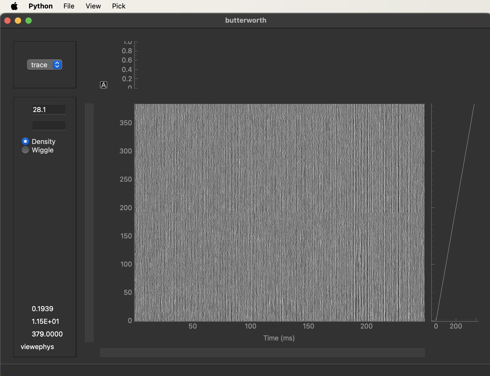
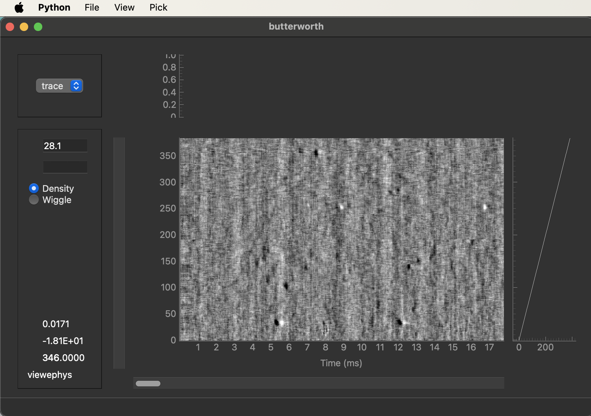

# Quickstart

Once you have completed the [installation](installation), you’re ready to start exploring your data with viewephys.

This guide covers the basic workflow, from launching the viewer and loading recordings to selecting an appropriate data view and navigating through channels and time. By the end, you should be able to open a dataset and confidently inspect your signals.

## Open an Existing Recording

> **Note:** If you installed viewephys in a virtual environment, ensure it is activated before running any of the commands below.

Launch viewephys in the command line:

```bash
viewephys
```
The Ephys Bin Viewer window will open.

To load a recording:

1. Select **File → Open**.
2. Navigate to the desired binary recording (`.bin` file).
3. Open the file.


## Monitor a Live Recording

viewephys can be used during data acquisition to monitor signal quality in real time.

Launch viewephys in the command line:

```bash
viewephys
```

1. Select **File → Open Live Recording**.
2. Navigate to the desired recording and select the corresponding `.bin` file.


### Selecting Data Views
viewephys allows you to switch between different filtered representations of the same recording, depending on the signals you want to inspect.

**Raw** - 
Display the unprocessed recording. No filtering. Useful for checking the original data and identifying acquisition artefacts.  

**AP band (high-pass 300 Hz)** - 
Display the high-frequency component of the recording commonly used for spike detection and analysis. This is typically the best view for inspecting neuronal spiking activity.

**LF broadband (high-pass 2 Hz)** - 
Display lower-frequency signals, including local field potentials (LFPs) and slow fluctuations in neural activity.

**AP band Destriped** - 
Display the AP band after additional preprocessing to reduce common recording artefacts and noise. This view can make spiking activity easier to inspect when recordings contain striping or correlated noise across channels.

**Using them in the Viewer**

1. Open a recording.
2. Tick one or more of the four checkboxes.
3. For each ticked box, a data window opens, titled with the mode name, showing that processed version at the chosen time.

Each window is independent. 

## Navigating the Data Viewer

Once your data has been loaded, the main viewer window can be used to explore signals across channels and time.

- The x-axis is time.
- The y-axis is recording channels.
- Signals can be viewed at different time scales and channel ranges.

Display style: radio buttons toggle "density" (heatmap image, default) vs. "wiggle" (individual trace lines)



### Navigating Through the Recording

Use the scroll bars to move through the dataset:

* The horizontal scroll bar moves forward and backward in time.
* The vertical scroll bar moves between channel ranges.
* To zoom in on a region of interest
    -     Right-click and drag horizontally to zoom into a specific time range
    -     Right-click and drag vertically to zoom into a specific range of channels.



### Adjusting Signal Gain

The gain control can be used to increase or decrease signal visibility.

Gain can be adjusted using:

- The gain control in the viewer 

Windows/linux 
- Ctrl + A or Page Up to increase gain by 3 dB
- Ctrl + Z or Page Down to decrease gain by 3 dB

MacOs 
- Cmd + A to decrease gain by 3 dB
- Cmd + Z to increase gain by 3 dB


### Explore viewephys further 

- [Viewer Guide](viewer-guide) – Learn how to navigate the interface and inspect recordings.

- [Python API](python-api) – Learn how to open recordings and visualize data from Python.
